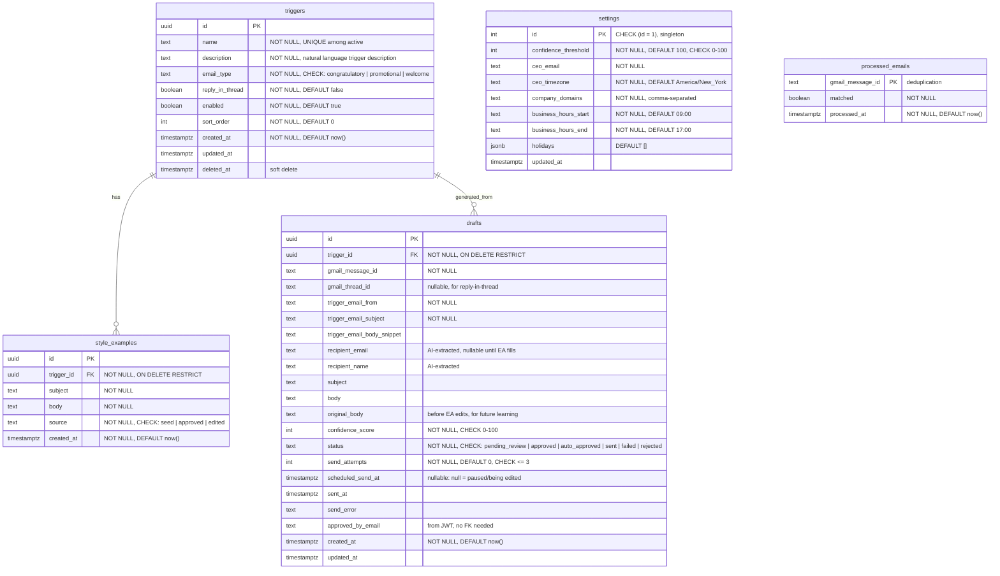

# feat: CEO Email Assistant (Debi Dashboard)

## Enhancement Summary

**Deepened on:** 2026-02-16
**Research agents used:** security-sentinel, performance-oracle, architecture-strategist, code-simplicity-reviewer, data-integrity-guardian, Claude API researcher, Supabase researcher, scheduling researcher

### Key Improvements

1. **Decouple cron jobs** — Split poll+classify from draft generation to avoid Vercel 60s timeout
2. **Use Claude Sonnet for classification** — 80% cost reduction vs Opus; reserve Opus for drafting only
3. **Prompt caching with `zodOutputFormat`** — 90% token savings on cached content; structured output via Zod schemas
4. **Simplify v1 scope** — Remove `style_rules` table, `users` table, `confidence_breakdown`, and complex draft locking; consolidate to 5 phases
5. **Database hardening** — Add indexes, CHECK constraints, single-row settings constraint, soft delete for triggers, state machine for draft status
6. **Security headers** — Add CSP, HSTS, X-Frame-Options; add rate limiting to API routes; add audit logging
7. **Use Luxon** for timezone-aware business hours scheduling
8. **Supabase SSR patterns** — Use `@supabase/ssr` with `createServerClient`/`createBrowserClient`, proper realtime cleanup with `removeChannel`

### Simplification Decisions (YAGNI)

| Removed from v1 | Reason | Add when... |
|---|---|---|
| `style_rules` table | Examples alone are sufficient; rule extraction is unproven | EA feedback shows patterns after 20+ edits |
| `users` table | Auth.js JWT handles identity; no need for DB users | Multi-role access control needed |
| `confidence_breakdown` JSONB | Single score is sufficient; sub-scores add complexity | EA requests visibility into scoring components |
| Complex draft locking | Null `scheduled_send_at` achieves the same goal | Multiple concurrent EAs editing simultaneously |
| Real-time dashboard | Single-user tool; 5-min poll intervals; manual refresh is fine | EA feedback says stale data is a problem |
| Style learning (diff analysis) | Edited drafts auto-become style examples; that's enough for v1 | Drift patterns emerge and need correction |
| Tablet responsive design | Desktop-only use case | EA requests mobile/tablet access |

---

## Overview

Build a Next.js web app that enables the CEO's executive assistant (EA) to review, edit, and approve AI-drafted emails sent as the CEO. The system polls the CEO's Gmail for trigger emails (exceptional sales, promotions, new hires), uses Claude to classify triggers and draft responses in the CEO's style, and sends via Gmail API service account impersonation. The EA can progressively increase autonomy via a confidence threshold slider.

## Problem Statement

The CEO needs to send personalized congratulatory, promotional, and welcome emails in response to internal events. Currently this is manual and inconsistent. An AI-assisted system with human-in-the-loop approval will ensure timely, on-brand communication while reducing the EA's workload.

## Technical Approach

### Architecture

```
┌─────────────────────────────────────────────────────────┐
│                    Vercel (Next.js)                       │
│                                                          │
│  ┌──────────┐  ┌─────────────┐  ┌────────────────────┐  │
│  │ Cron Job │  │  API Routes  │  │   App Router UI    │  │
│  │ (5 min)  │  │  /api/*      │  │   /dashboard       │  │
│  └────┬─────┘  └──────┬──────┘  │   /admin/triggers   │  │
│       │               │         │   /settings          │  │
│       ▼               ▼         └────────────────────┘  │
│  ┌─────────────────────────┐                             │
│  │       lib/ services     │                             │
│  │  gmail.ts  claude.ts    │                             │
│  │  scheduler.ts           │                             │
│  └────┬──────────┬─────────┘                             │
└───────┼──────────┼───────────────────────────────────────┘
        │          │
   ┌────▼───┐  ┌──▼──────┐  ┌───────────┐
   │ Gmail  │  │ Claude  │  │ Supabase  │
   │  API   │  │   API   │  │ Postgres  │
   └────────┘  └─────────┘  └───────────┘
```

### Tech Stack

- **Next.js 15 + TypeScript** — App Router, API routes, Vercel Cron
- **Auth.js v5** — Google OAuth provider, allowlist in env var
- **Supabase** — Postgres database (use `@supabase/ssr` with `createServerClient`/`createBrowserClient`)
- **Claude API** (`@anthropic-ai/sdk`) — Sonnet for classification, Opus for drafting; prompt caching with `cache_control: { type: 'ephemeral' }`; structured output via `zodOutputFormat` from `@anthropic-ai/sdk/helpers/zod`
- **Gmail API** (`googleapis`) — Polling inbox + sending via service account impersonation
- **Luxon** — Timezone-aware business hours scheduling (preferred over date-fns for interval/timezone support)
- **Zod** — Schema validation for Claude structured output + API request validation
- **Tailwind CSS + shadcn/ui** — UI components
- **Vercel** — Hosting + Cron

### Database Schema

**Simplified for v1** — removed `users` table (Auth.js JWT handles identity), `style_rules` table (YAGNI), and `confidence_breakdown` column. Added constraints, indexes, and soft delete.



### Database Constraints & Indexes

```sql
-- Singleton settings constraint (prevents multiple rows)
ALTER TABLE settings ADD CONSTRAINT settings_singleton CHECK (id = 1);

-- Soft delete: prevent hard deletion of triggers
CREATE UNIQUE INDEX idx_triggers_name_active ON triggers(name) WHERE deleted_at IS NULL;

-- Draft status state machine (application-enforced, DB has CHECK)
-- Valid transitions: pending_review → approved|rejected, approved → sent|failed, auto_approved → sent|failed

-- Performance indexes
CREATE INDEX idx_drafts_status_scheduled ON drafts(status, scheduled_send_at)
  WHERE status IN ('approved', 'auto_approved') AND sent_at IS NULL;
CREATE INDEX idx_drafts_created_at ON drafts(created_at DESC);
CREATE INDEX idx_drafts_trigger_id ON drafts(trigger_id);
CREATE INDEX idx_drafts_gmail_message_id ON drafts(gmail_message_id);
CREATE INDEX idx_processed_emails_processed_at ON processed_emails(processed_at DESC);
CREATE INDEX idx_style_examples_trigger ON style_examples(trigger_id, created_at DESC);
CREATE INDEX idx_triggers_enabled ON triggers(enabled, sort_order) WHERE deleted_at IS NULL;
```

### Implementation Phases

> **Consolidated from 7 → 5 phases** per simplicity review. Logging/observability moved to Phase 1 (not deferred to polish). Basic dashboard added in Phase 2 to enable earlier testing.

#### Phase 1: Foundation (Project Setup + Auth + Database + Logging)

**Deliverables:** Scaffolded Next.js app, Google OAuth login with allowlist, Supabase connected, basic layout, logging infrastructure.

- [ ] Initialize Next.js 15 + TypeScript project with App Router
- [ ] Install dependencies: `next-auth`, `@supabase/ssr`, `@supabase/supabase-js`, `@anthropic-ai/sdk`, `googleapis`, `luxon`, `zod`, `tailwindcss`, `shadcn/ui`
- [ ] Configure Auth.js v5 with Google provider (`app/auth.ts`)
  - Allowlist check in `signIn` callback against `ALLOWED_EMAILS` env var
  - JWT strategy (no database sessions needed for this scale)
  - Session timeout: 8h max, 30min inactivity
- [ ] Set up Supabase project and create database schema (migration SQL)
  - `app/lib/supabase/server.ts` — server client using `createServerClient` from `@supabase/ssr`
  - `app/lib/supabase/client.ts` — browser client using `createBrowserClient` from `@supabase/ssr`
  - Include all indexes and CHECK constraints from schema above
  - Seed singleton settings row: `INSERT INTO settings (id, ceo_email, company_domains) VALUES (1, '...', '...')`
- [ ] Create middleware for auth protection (`middleware.ts`)
  - Protect all routes except `/login` and `/api/auth/*` and `/api/cron/*`
  - Add rate limiting (simple in-memory for v1)
- [ ] Add security headers in `next.config.js`: CSP, X-Frame-Options DENY, X-Content-Type-Options nosniff, HSTS, Referrer-Policy
- [ ] Build basic layout: sidebar nav (Dashboard, Triggers, Settings), header with user info + logout
- [ ] Create shared types (`app/lib/types.ts`) — Draft, Trigger, Settings, ClassificationResult, DraftResult interfaces
- [ ] Create error handling utilities (`app/lib/errors.ts`) — typed errors for Gmail, Claude, scheduling
- [ ] Create logger utility (`app/lib/logger.ts`) — structured logging for cron jobs and API routes
- [ ] Create `.env.local` template and `.env.example`

```
# .env.example
AUTH_GOOGLE_ID=
AUTH_GOOGLE_SECRET=
AUTH_SECRET=
ALLOWED_EMAILS=ea@company.com,backup-ea@company.com
NEXT_PUBLIC_SUPABASE_URL=
NEXT_PUBLIC_SUPABASE_ANON_KEY=
SUPABASE_SERVICE_ROLE_KEY=
GOOGLE_SERVICE_ACCOUNT_EMAIL=
GOOGLE_SERVICE_ACCOUNT_PRIVATE_KEY=
CEO_EMAIL=ceo@company.com
ANTHROPIC_API_KEY=
CRON_SECRET=
```

**Files:**
- `app/auth.ts`
- `app/api/auth/[...nextauth]/route.ts`
- `middleware.ts`
- `next.config.js` (security headers)
- `app/lib/supabase/server.ts`
- `app/lib/supabase/client.ts`
- `app/lib/types.ts`
- `app/lib/errors.ts`
- `app/lib/logger.ts`
- `app/layout.tsx`
- `app/login/page.tsx`
- `app/(protected)/layout.tsx`
- `supabase/migrations/001_initial_schema.sql`

**Success criteria:** EA can log in with Google, non-allowlisted users are rejected, protected pages require auth, security headers present.

---

#### Phase 2: Gmail Polling + Classification + Basic Dashboard

**Deliverables:** Cron job polls CEO inbox and classifies emails. Basic read-only dashboard to verify results.

> **Research insight:** Classification and draft generation MUST be separate cron jobs. Running both sequentially on 20 emails would exceed Vercel's 60s timeout (20 × 3s classification + 20 × 5s drafting = 160s). Split into poll-and-classify + generate-drafts.

- [ ] Build Gmail service (`app/lib/gmail.ts`)
  - `getGmailClient(userEmail)` — JWT auth with service account impersonation
  - `fetchNewEmails(since: Date)` — list unread emails from internal domains
  - `getEmailContent(messageId)` — fetch full email body, extract sender/subject/body
  - `sendEmail(to, subject, body, threadId?)` — send as CEO (used later in Phase 4)
  - Implement exponential backoff on 429 errors (1s, 2s, 4s, max 3 retries)
- [ ] Build classifier service (`app/lib/claude.ts`)
  - `classifyEmail(emailContent, triggers[])` — returns `{ triggerId, confidence, recipientEmail, recipientName }` or `null`
  - **Use Claude Sonnet for classification** (not Opus — 80% cheaper, sufficient accuracy for trigger matching)
  - Prompt caching: place system instructions + trigger descriptions in `system` array with `cache_control: { type: 'ephemeral' }` — saves 90% on repeated calls
  - **Structured output via `zodOutputFormat`**:
    ```typescript
    import { zodOutputFormat } from '@anthropic-ai/sdk/helpers/zod';
    const response = await anthropic.messages.create({
      model: 'claude-sonnet-4-5-20250929',
      max_tokens: 500,
      system: [
        { type: 'text', text: 'Classification instructions...', cache_control: { type: 'ephemeral' } },
        { type: 'text', text: JSON.stringify(triggers), cache_control: { type: 'ephemeral' } }
      ],
      messages: [{ role: 'user', content: emailContent }],
      output_config: { format: zodOutputFormat(ClassificationSchema) }
    });
    ```
  - **Important**: `output_config.format` (not `output_format`) — changed in 2026. Changing schema invalidates cache, so keep stable.
- [ ] Build poll-and-classify cron route (`app/api/cron/poll-classify/route.ts`)
  - Verify `CRON_SECRET` authorization header
  - Fetch settings (company domains, CEO email) — cache in-memory for 60s
  - Call `fetchNewEmails` filtered to internal domains only
  - Process in parallel batches of 5 to stay under 60s:
    ```typescript
    const BATCH_SIZE = 5;
    for (let i = 0; i < Math.min(emails.length, 20); i += BATCH_SIZE) {
      await Promise.all(batch.map(email => classifyAndStore(email)));
    }
    ```
  - For each email: check `processed_emails` for dedup, classify, insert draft with `status = 'needs_drafting'`, insert `processed_emails`
  - Use Supabase RPC for atomic draft+dedup insertion (single transaction)
  - Handle errors per-email (don't let one failure stop the batch)
  - Log metrics: emails scanned, matched, errors, cache hit rate
- [ ] Build basic read-only dashboard (`app/(protected)/dashboard/page.tsx`)
  - Server Component, fetches drafts using Supabase join to avoid N+1:
    ```typescript
    const { data } = await supabase.from('drafts').select('*, trigger:triggers(name, email_type)').order('created_at', { ascending: false });
    ```
  - Show draft list: status, recipient, subject, confidence, created time
  - Manual refresh (no real-time for v1)
- [ ] Configure `vercel.json` with cron schedule

```json
{
  "crons": [
    { "path": "/api/cron/poll-classify", "schedule": "*/5 * * * *" }
  ]
}
```

- [ ] Add `maxDuration = 60` export to cron route (Vercel Pro plan)

**Files:**
- `app/lib/gmail.ts`
- `app/lib/claude.ts`
- `app/api/cron/poll-classify/route.ts`
- `app/(protected)/dashboard/page.tsx`
- `app/components/draft-card.tsx`
- `vercel.json`

**Edge cases handled:**
- Duplicate email processing: `processed_emails` table with unique constraint on `gmail_message_id`
- Bulk emails after downtime: 20-email cap per cycle, parallel batches of 5
- Multiple trigger matches: use highest confidence match only
- No recipient extractable: draft created with `recipient_email = null`, status `pending_review` (EA must fill in)

**Success criteria:** Cron runs every 5 min, classifies test emails, results visible on dashboard. No duplicate processing. Cron completes in <30s.

---

#### Phase 3: Draft Generation + Scheduling + Approval Workflow

**Deliverables:** AI drafts emails in CEO's style, assigns randomized send times, EA can edit/approve/reject.

- [ ] Build draft generation cron (`app/api/cron/generate-drafts/route.ts`)
  - Runs every minute: `"* * * * *"`
  - Pick up drafts with `status = 'needs_drafting'`, limit 5 per cycle
  - **Use Claude Opus for drafting** (higher quality for CEO voice matching)
  - Prompt caching on style examples: place in `system` array with `cache_control: { type: 'ephemeral' }`
  - Fetch style examples for matched trigger (limit to 5 most recent)
  - On success: update draft with subject, body, confidence, `scheduled_send_at`, status → `pending_review` or `auto_approved`
- [ ] Build scheduler utility (`app/lib/scheduler.ts`)
  - `calculateSendTime(triggerReceivedAt, settings)` — returns randomized time 4-6 business hours later
  - **Use Luxon** for timezone-aware calculations:
    ```typescript
    import { DateTime } from 'luxon';
    const triggerTime = DateTime.fromJSDate(triggerReceivedAt).setZone(settings.ceo_timezone);
    ```
  - Business hours: roll forward to next business day if computed time is outside hours or on weekend
  - Holiday check against `settings.holidays` array
  - Apply jitter: randomize within the 4-6 hour window (not fixed offset)
  - Space out multiple sends: no two sends within 15 minutes of each other (query existing scheduled drafts)
- [ ] Seed data: SQL script or admin endpoint to upload initial style examples per trigger
- [ ] Upgrade dashboard to full approval workflow:
  - Draft detail/edit view (`app/(protected)/dashboard/[id]/page.tsx`)
  - Editable fields: recipient, subject, body
  - Single confidence score display
  - Trigger email context (what triggered this draft)
  - Actions: Approve, Reject, Save Edits
  - Send time display with manual override option
- [ ] Approval API route (`app/api/drafts/[id]/approve/route.ts`)
  - If EA edited the draft: store original body in `original_body`, store edited version as new `style_example` (source: "edited")
  - Set status to `approved`, record `approved_by_email` from JWT
  - **No diff analysis or rule extraction for v1** — just save the edited draft as an example
- [ ] Reject API route (`app/api/drafts/[id]/reject/route.ts`)
- [ ] Auto-approval logic in generate-drafts cron:
  - If confidence >= threshold AND recipient present: `status = 'auto_approved'`
  - If confidence < threshold OR no recipient: `status = 'pending_review'`
  - Borderline buffer: scores within 5 points of threshold always go to `pending_review`

```json
{
  "crons": [
    { "path": "/api/cron/poll-classify", "schedule": "*/5 * * * *" },
    { "path": "/api/cron/generate-drafts", "schedule": "* * * * *" }
  ]
}
```

**Files:**
- `app/api/cron/generate-drafts/route.ts`
- `app/lib/claude.ts` (extended with `draftEmail`)
- `app/lib/scheduler.ts`
- `app/(protected)/dashboard/[id]/page.tsx`
- `app/api/drafts/[id]/approve/route.ts`
- `app/api/drafts/[id]/reject/route.ts`
- `app/components/draft-editor.tsx`
- `app/components/confidence-badge.tsx`

**Success criteria:** Drafts generated with appropriate style, send times within business hours, EA can edit/approve/reject. Edited drafts saved as style examples.

---

#### Phase 4: Email Sending + Auto-Send

**Deliverables:** Approved emails are sent at scheduled time. Auto-send for high-confidence drafts.

- [ ] Build send worker cron (`app/api/cron/send-emails/route.ts`)
  - Runs every minute: `"* * * * *"`
  - Query drafts where `status IN ('approved', 'auto_approved') AND scheduled_send_at <= NOW() AND scheduled_send_at IS NOT NULL AND sent_at IS NULL`
  - For each: call `sendEmail` via Gmail API
  - On success: update `status = 'sent'`, set `sent_at`
  - On failure: increment `send_attempts`, update `send_error`; if `send_attempts >= 3`, mark `failed`
  - Verify `CRON_SECRET` header
- [ ] **Race condition protection (simplified):**
  - When EA opens a draft for editing, set `scheduled_send_at = null` (pauses sending)
  - Send worker only queries drafts where `scheduled_send_at IS NOT NULL`
  - On approve, EA sets new `scheduled_send_at` (or keeps existing)
  - No locks, no expiry, no race conditions
- [ ] Gmail quota awareness: log quota usage per day; if approaching 80% of 10K daily units, reduce batch size

```json
{
  "crons": [
    { "path": "/api/cron/poll-classify", "schedule": "*/5 * * * *" },
    { "path": "/api/cron/generate-drafts", "schedule": "* * * * *" },
    { "path": "/api/cron/send-emails", "schedule": "* * * * *" }
  ]
}
```

**Files:**
- `app/api/cron/send-emails/route.ts`
- `vercel.json` (updated)

**Success criteria:** Approved emails send at scheduled time. High-confidence drafts auto-send. No race conditions between EA edits and sends.

---

#### Phase 5: Admin UI + Settings + Polish

**Deliverables:** EA can manage triggers and system settings. Production readiness.

- [ ] Trigger management page (`app/(protected)/admin/triggers/page.tsx`)
  - List all triggers with enable/disable toggle
  - Add new trigger: name, natural language description, email type, reply-in-thread toggle
  - Edit existing trigger
  - Delete trigger (soft delete — `UPDATE deleted_at = now()`, hidden from list)
  - Reorder triggers (drag or up/down buttons)
- [ ] Settings page (`app/(protected)/settings/page.tsx`)
  - Confidence threshold slider (0-100) with explanation
  - CEO timezone selector
  - Business hours start/end
  - Company domains (comma-separated text input)
  - Holiday management (add/remove dates)
  - Use `.maybeSingle()` for settings queries (graceful null handling)
- [ ] Style examples management per trigger
  - View existing examples (including EA-edited ones)
  - Add new example (paste in a real CEO email)
  - Delete example
- [ ] Settings API routes
  - `app/api/settings/route.ts` — GET/PUT
  - `app/api/triggers/route.ts` — GET/POST
  - `app/api/triggers/[id]/route.ts` — PUT/DELETE
- [ ] System health indicator on dashboard: last successful poll time, pending draft count, errors in last 24h
- [ ] Sent emails history view with search/filter
- [ ] Stale draft warnings (drafts older than 7 days in `pending_review`)
- [ ] Error notification: if polling or sending fails 3+ times, show banner on dashboard
- [ ] Loading states, error boundaries, empty states throughout UI
- [ ] Deploy to Vercel with environment variables configured

**Files:**
- `app/(protected)/admin/triggers/page.tsx`
- `app/(protected)/admin/triggers/[id]/page.tsx`
- `app/(protected)/settings/page.tsx`
- `app/api/settings/route.ts`
- `app/api/triggers/route.ts`
- `app/api/triggers/[id]/route.ts`
- `app/api/triggers/[id]/examples/route.ts`
- `app/components/trigger-form.tsx`
- `app/components/settings-form.tsx`
- `app/components/threshold-slider.tsx`
- `app/components/system-status.tsx`
- `app/(protected)/dashboard/history/page.tsx`

**Success criteria:** EA can add/edit/disable triggers, adjust confidence threshold, configure business hours and holidays. App is production-ready.

## Acceptance Criteria

### Functional Requirements

- [ ] EA can log in with Google OAuth; non-allowlisted users are rejected
- [ ] System polls CEO Gmail every 5 minutes for unread internal emails
- [ ] Trigger emails are classified against natural-language descriptions using Claude Sonnet
- [ ] Matched triggers produce AI-drafted emails in the CEO's writing style using Claude Opus
- [ ] Drafts appear on dashboard with recipient, subject, body, confidence score, and scheduled send time
- [ ] EA can edit any field (recipient, subject, body) and approve or reject
- [ ] Approved emails send at the scheduled time via Gmail API impersonation
- [ ] EA edits are saved as new style examples for future drafting
- [ ] Confidence threshold slider controls auto-send behavior
- [ ] EA can add, edit, enable/disable triggers through admin UI
- [ ] Send times are randomized 4-6 business hours out, respecting timezone and holidays
- [ ] No duplicate processing of the same email
- [ ] Drafts with missing recipients require EA to fill in before approval

### Non-Functional Requirements

- [ ] Poll-classify cron completes within 30 seconds (leave buffer under 60s Vercel limit)
- [ ] Generate-drafts cron completes within 30 seconds
- [ ] Dashboard loads in under 2 seconds
- [ ] All API keys and credentials stored in environment variables, never in code
- [ ] Cron routes protected by `CRON_SECRET`
- [ ] Security headers present: CSP, HSTS, X-Frame-Options, X-Content-Type-Options
- [ ] Draft content stored in Supabase with TLS in transit
- [ ] Claude API prompt caching active (monitor `cache_read_input_tokens` in responses)

## Dependencies & Prerequisites

- [ ] Google Cloud project with Gmail API enabled
- [ ] Google Service Account with domain-wide delegation configured
  - Scopes: `https://www.googleapis.com/auth/gmail.readonly`, `https://www.googleapis.com/auth/gmail.send`
- [ ] Google OAuth client (web application type) configured with redirect URI
- [ ] Supabase project created
- [ ] Anthropic API key
- [ ] Vercel Pro plan (for 5-min cron and 60s function timeout)
- [ ] 5-10 example CEO emails per email type for style seeding

## Risk Analysis & Mitigation

| Risk | Impact | Mitigation |
|------|--------|------------|
| Gmail API rate limiting | Emails not processed | 20-email cap per poll, exponential backoff on 429s, quota tracking |
| Gmail API quota exhaustion | Service outage after ~3 hours | Adaptive batch sizing, quota monitoring, alert at 80% |
| Claude API outage | No classification or drafting | Drafts stay in `needs_drafting`, retry on next cron cycle |
| Claude API cost overrun | Unexpected spend | Sonnet for classification (80% cheaper), prompt caching (90% savings), daily spend monitoring |
| Cron job timeout | Incomplete processing | Decoupled cron jobs (poll/classify separate from drafting), parallel batches of 5 |
| Service account token issues | Polling/sending fails silently | Health check on dashboard, structured logging |
| Style examples degrade quality | CEO voice drifts | EA can delete bad examples, start with high threshold |
| EA edits during auto-send window | Wrong version sent | Null `scheduled_send_at` when editing (no locks needed) |
| Vercel Cron missed execution | Delayed processing | Idempotent cron design, catches up on next run |
| Trigger deletion with active drafts | Orphaned drafts | Soft delete with RESTRICT FK; never hard-delete triggers |

## Key Design Decisions

From brainstorm (2026-02-16) + deepening research:

1. **Polling over Pub/Sub** — 5-min polling sufficient for 4-6 hour send window
2. **Internal domains only** — pre-filter to control cost and noise
3. **Claude Sonnet for classification, Opus for drafting** — 80% cost savings on classification
4. **Few-shot examples only for v1** — edited drafts auto-become examples; defer rule extraction to v2
5. **Global confidence threshold** — single slider, not per-type
6. **Randomized send timing via Luxon** — 4-6 business hours, timezone-aware, with jitter
7. **Thread vs standalone per trigger** — configurable
8. **Send confirmation only** — no open tracking
9. **EA-only tool** — CEO sees sent emails in Sent folder via impersonation
10. **Decoupled cron jobs** — separate poll/classify from draft generation to avoid timeout
11. **Null scheduling for edit protection** — no locks; set `scheduled_send_at = null` when editing
12. **Prompt caching with stable schemas** — `cache_control: { type: 'ephemeral' }` on system prompts; keep `output_config.format` stable to avoid cache invalidation

## Security Checklist (Pre-Production)

- [ ] Security headers configured (CSP, HSTS, X-Frame-Options, X-Content-Type-Options, Referrer-Policy)
- [ ] All environment variables in Vercel encrypted storage
- [ ] Cron routes verify `CRON_SECRET` authorization header
- [ ] Rate limiting on API routes
- [ ] Session timeout configured (8h max, 30min inactivity)
- [ ] CSRF protection via Auth.js + SameSite cookies
- [ ] `ALLOWED_EMAILS` checked on every auth callback
- [ ] No secrets in client-side code (`NEXT_PUBLIC_*` only for Supabase URL/anon key)
- [ ] Gmail API: domain-wide delegation scoped to minimum (readonly + send only)
- [ ] Anthropic API: monitor daily spend, set `max_tokens` limits on all calls

## References

### External

- [Auth.js v5 Google Provider](https://authjs.dev/getting-started/migrating-to-v5)
- [Gmail API Push Notifications](https://developers.google.com/workspace/gmail/api/guides/push) (upgrade path)
- [Gmail Domain-Wide Delegation](https://support.google.com/a/answer/162106)
- [Supabase Next.js SSR Guide](https://supabase.com/docs/guides/auth/server-side/nextjs)
- [Vercel Cron Docs](https://vercel.com/docs/cron-jobs)
- [Anthropic TypeScript SDK](https://github.com/anthropics/anthropic-sdk-typescript)
- [Claude Prompt Caching](https://platform.claude.com/docs/en/build-with-claude/prompt-caching)
- [Claude Structured Outputs](https://platform.claude.com/docs/en/build-with-claude/structured-outputs)
- [Luxon — Timezone-aware Date Library](https://moment.github.io/luxon/)

### Version Gotchas (2025-2026)

- **Next.js 15+**: `cookies()`, `params`, `searchParams` are async — always `await`
- **Auth.js v5**: Env vars changed from `NEXTAUTH_*` to `AUTH_*`; cookie name changed
- **Supabase SSR**: Must use `@supabase/ssr` with `createServerClient`/`createBrowserClient`, not `@supabase/supabase-js` directly. Old `@supabase/auth-helpers-nextjs` is deprecated.
- **Supabase Realtime cleanup**: Always call `supabase.removeChannel(channel)` in `useEffect` cleanup; use `useRef` to prevent duplicate subscriptions
- **Vercel Cron**: No auto-retry on failure; Hobby plan limited to 10s/daily; Pro plan needed for 60s + 5-min schedule
- **Gmail API**: Service account impersonation requires Workspace, not free Gmail
- **Anthropic SDK**: Use `output_config.format` (not deprecated `output_format`); `zodOutputFormat` from `@anthropic-ai/sdk/helpers/zod`; no beta header needed for prompt caching or structured output
- **Anthropic Prompt Caching**: Minimum cacheable tokens — Sonnet: 1,024; Opus: 4,096. Cache TTL: 5 min (refreshed on use). Feb 2026: caches isolated per workspace, not org.
- **Supabase `.maybeSingle()`**: Use instead of `.single()` for settings queries — returns null gracefully if no row exists
